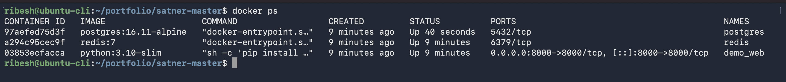
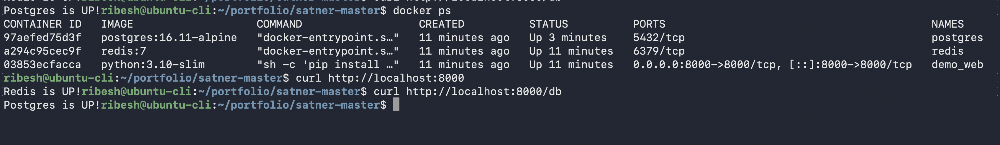
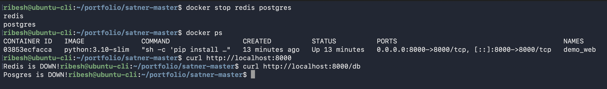
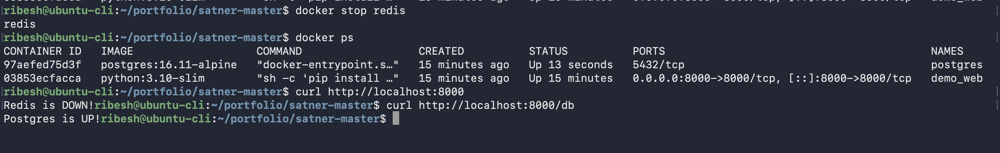

# README

## Instructions:

### Step 1:
>Edit the `requirements.txt` file to add `psycopg2-binary` library

```bash
flask
redis
psycopg2-binary         #<===== HERE
```

### Step 2:
>Edit the `app.py` to include `check_postgres()` function at path `/db`

```bash
from flask import Flask
import redis
import psycopg2         #<======= HERE

app = Flask(__name__)

r = redis.Redis(host="redis", port=6379)

@app.route("/") 
def check_redis():
    try:
        r.ping()
        return "Redis is UP!"
    except:
        return "Redis is DOWN!"

@app.route("/db")           #<======= HERE
def check_postgres():
    try:
        conn = psycopg2.connect(
            host="postgres",
            #database="ribesh",
            user="postgres",
            password="P@ssw0rd01"
        )
        conn.close()
        return "Postgres is UP!"
    except:
        return "Posgres is DOWN!"
        

if __name__ == "__main__":
    app.run(host="0.0.0.0", port=8000)
```

### Step3: 
>Updated the `docker-compose.yaml` file to include `postgres` container

```bash
services:

  web:
    image: python:3.10-slim
    container_name: demo_web
    working_dir: /app
    volumes:
      - .:/app
    command: >
      sh -c "pip install -r requirements.txt && python app.py"
    ports:
      - "8000:8000"
    networks:
      - app_net

  redis:
    image: redis:7
    container_name: redis
    volumes:
      - redis_log:/var/log/redis
    networks:
      - app_net

  db:                   #<====== HERE
    image: postgres:16.11-alpine
    container_name: postgres
    environment:
      POSTGRES_PASSWORD: "P@ssw0rd01"
    networks:
      - app_net

volumes:
  redis_log:

networks:
  app_net:
    driver: bridge
```

### Step 4:
In the directory containing the `docker-compose.yaml` run the below command 👇
```bash
docker compose up -d
```

### Step 5:
Verify
```bash
docker ps
```




### Step 6:
Use `curl` command to verify the endpoints

```bash
#for redis
curl http://localhost

#for postgres
curl http://localhost/db
```



### Step 7:
>Sanity Checks

#### A. Stopping both containers
```bash
docker stop redis postgres
```



#### B. Stopping either of the containers
```bash
docker stop redis
```

